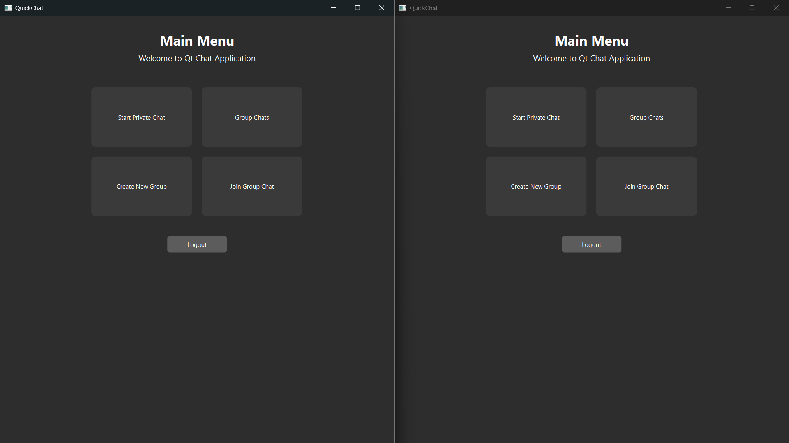
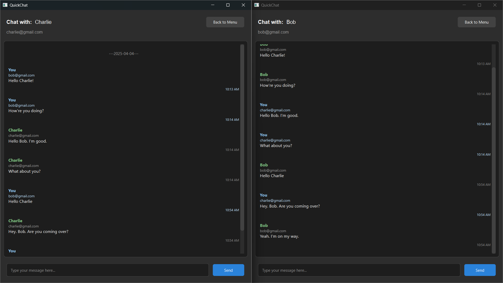
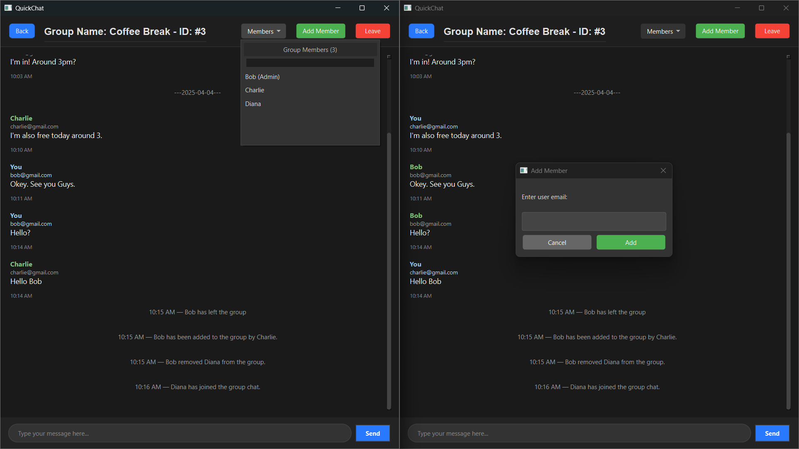
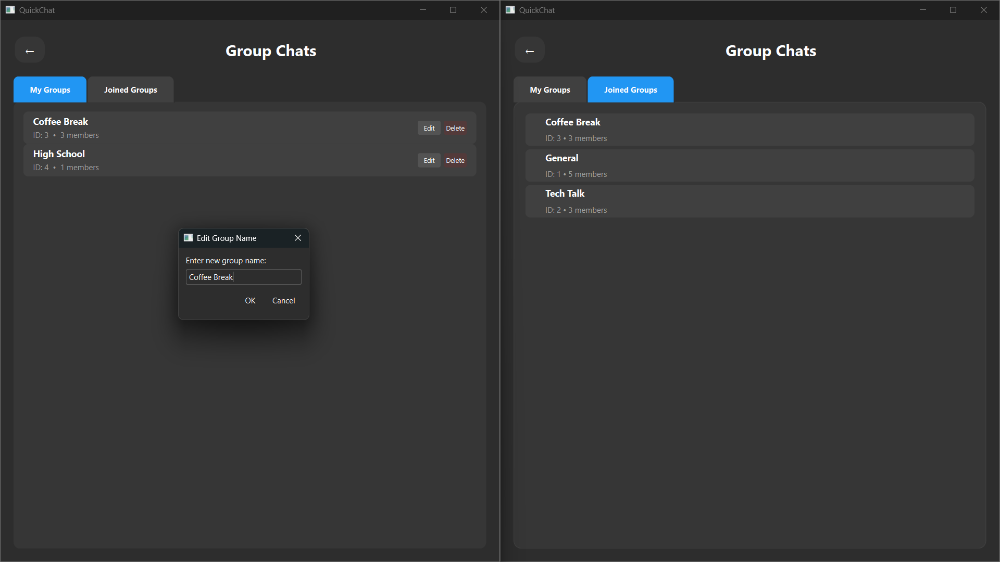

# QuickChat

A modern chat application built with Qt6 that supports both private and group chat functionality.

This project is our **final project** for Object-Oriented Programming Class during our 2nd semester of 1st year, developed to demonstrate our understanding of C++ programming, database management, and GUI design using Qt.

QuickChat is a messaging app designed for easy and efficient communication. It supports both private and group chats, providing a simple and user-friendly interface. Messages are stored securely in a local SQLite database, ensuring they remain accessible whenever needed.

## Team

1. Saw Zi Dunn - 67011653@kmitl.ac.th

2. Kyi Thant Sin - 67011158@kmitl.ac.th

## Demonstration Video

Click [here](https://youtu.be/yGSxHukRwdI) to watch Demonstration Video.

## Screenshots

### User Menu



### Private Chat



### Group Chat



### View Group List



## Features

-   **Private Chat Messaging**

    -   Users can engage in one-on-one private conversations in a dedicated chat window. Messages are stored in a local SQLite database, ensuring they remain available even after closing the application.

-   **Group Chat Functionality**

    -   Users can participate in group conversations, sending and receiving messages in real time. Messages in group chats are stored persistently, allowing users to view the chat history at any time.

-   **Create and Manage Groups**

    -   Any user can create a new group and invite members. Group creation is simple, requiring only a group name.

-   **Add and Remove Members**

    -   All group members can invite new users to the group.

    -   Admins have the ability to remove (kick) members from the group.

-   **Join and Leave Groups**

    -   Users can search for and join existing groups to participate in discussions.

    -   If a user no longer wants to be part of a group, they can leave the group at any time.

-   **Activity Tracking & Database Persistence**

    -   All actions—such as sending messages, creating groups, adding/removing members, joining/leaving groups—are recorded in the SQLite database.

    -   Other users can see these changes, ensuring everyone stays updated with the latest group modifications.

-   **Intuitive Multi-Window User Interface**

    -   The application features separate windows for private chats, group chats, and menu navigation, making it easy to manage multiple conversations.

## Code Overview

### `main.cpp`

-   Entry point of the application. Initializes the main window and manages the application lifecycle.

### `mainwindow.h/.cpp/.ui`

-   Main application window that handles Login and Register.

### `menuwidget.h/.cpp`

-   Implements the main menu UI after login, providing access to private and group chats.

### `privatechatwidget.h/.cpp`

-   Handles private chat functionality, including message sending, display, and date-based message separation.

### `groupchatwidget.h/.cpp`

-   Implements group chat functionality, allowing users to send and receive messages within a group.

### `groupchatlistwidget.h/.cpp`

-   Displays a list of groups that the user has created or joined.

### `chatdbhandler.h/.cpp`

-   Manages database operations related to chat messages, user authentication, and message storage.

### `setup_db.h`

-   Defines the initial database schema setup, including table creation and migrations.

## Technologies Used

### Framework

-   Qt6 (6.5+)
    -   Qt Widgets for the GUI components
    -   Qt SQL for database operations

### Backend

-   C++17
-   SQLite for data persistence
-   Custom database handler for efficient message management

### Build System

-   CMake 3.19+
-   Qt's build tools and deployment system

### Architecture

-   Widget-based UI components
-   Event-driven communication system
-   Modular design with separate components for chat, database, and UI management

## Installation

### Prerequisites

Ensure you have the following installed on your system:

-   Qt 6.5+
-   CMake 3.19+
-   A C++17 compatible compiler

### Build & Run

```sh
git clone https://github.com/yourusername/QuickChat.git
cd QuickChat
mkdir build && cd build
cmake ..
make
./QuickChat
```
